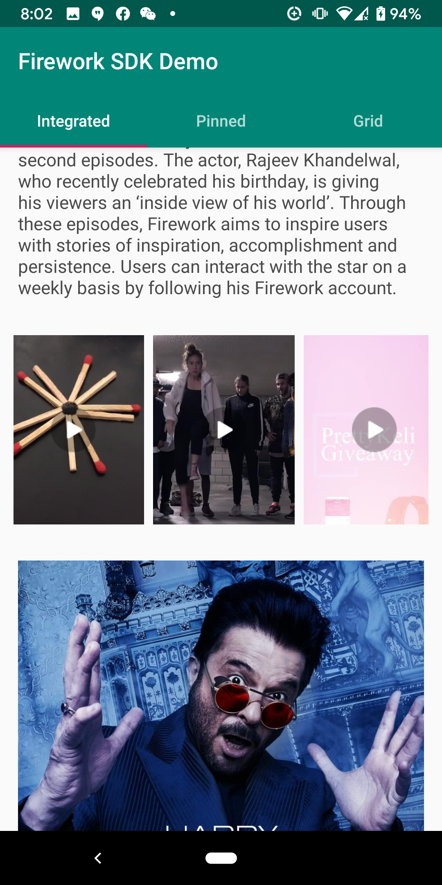
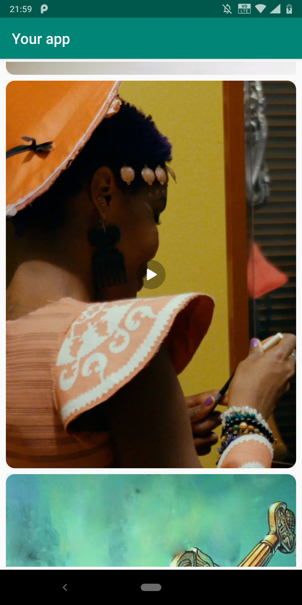
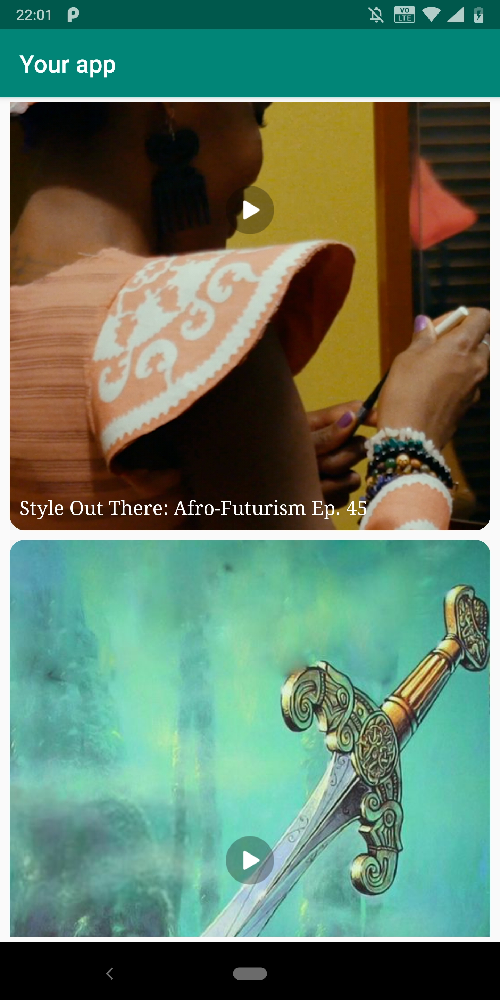
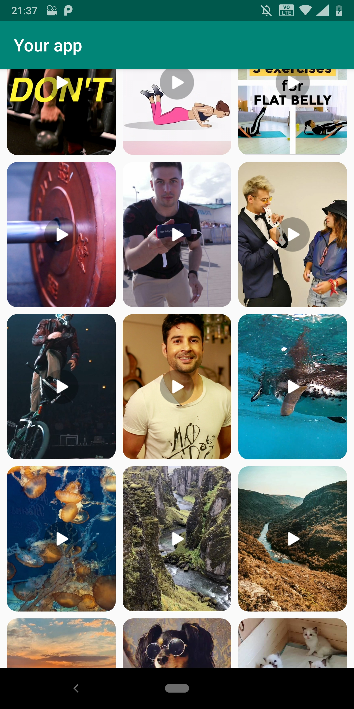
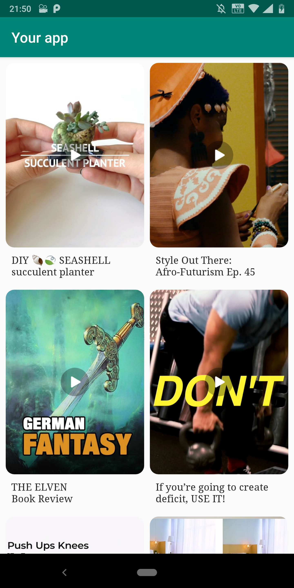

# FireworkSDK
FireworkSDK is a library to integrate video feeds from ```Firework - a short form video platform``` into your Android application. 

# FireworkSDK Demo 
https://github.com/loopsocial/firework_sdk_official/blob/master/FireworkDemo.apk

# Prerequisites 
To integrate FireworkSDK into your applicaiton, you have to register your application with Firework platform. You have to provide <package_name> of your application and it must be the same as package name in AndroidManifest.xml. Once you register your application, you will be provided with unique app_id. The unique app_id is required to authenticate client with Firework platform. Check more details about its usage in the later sections. 

# How to use library? 

In your AndroidManifest.xml, add

	<application
	
		<activity android:name=".MainActivity">
		    <intent-filter>
			<action android:name="android.intent.action.MAIN" />
			<category android:name="android.intent.category.LAUNCHER" />
			...
		    </intent-filter>
		</activity>
		
		// This is a must activity for playback.
		<activity android:name="com.loopnow.fireworklibrary.PlaybackActivity"
		    android:screenOrientation="portrait"/>
		    
		<uses-library android:name="org.apache.http.legacy" android:required="false"/>

	</application>
    
In build.gradle of your app, add 

	dependencies {
		------ other dependencies 
		------ 
		------
		implementation 'com.github.loopsocial:firework_sdk:v1.1.7'
	}


	android {
		dataBinding {
		enabled = true
	}

	compileOptions {
		sourceCompatibility 1.8
		targetCompatibility 1.8
	     }
	}
	
In build.gradle of your project, add 
	
	allprojects {
		repositories {
			--
			---
			--- 
			maven { url 'https://jitpack.io' }
		}
	}
	
	
	

# How to integrade firework video feed in your application using FireworkSDK?
FireworkSDK provides two options to integrate Firework video feed in your application.
- Fragment: This out of box solution. You can add FireworkVideoFeed fragment into your view hierarchy and you are good to go. We highly recommend you use this approach.    
- VideoView: This is custom view and wraps FireworkVideoPlayer. It will play the video that you set with setVideo method. 

We will discuss both of these approaches in the subsequent sections. 

**Fragment:**

This is the quickest and easiest way to receiving Firework video feed in your applicaiton. The fragment will handle initializing ```FireworkSDK```, authenticating your applicaiton with ```Firework platform``` and displaying the video feed as well as handling video playback on your behalf in your application. The approach hides all the intricacies of authenticating,  requesting video feed and playing it. 


You can add the following fragment to your view hierarchy with requried parameters and its done.  
				
			<fragment android:id="@+id/{your_fragment_id}"
	   			android:name="com.loopnow.fireworklibrary.views.VideoFeedFragment"
	   			android:layout_width="{your_fragment_width}"
	   			android:layout_height="{your_fragment_height}"
	   			app:showTitle="{true / false}"
	   			app:appid="{provide_your_app_id}"
	   			app:feedLayout="{grid | horizontal | vertical}"
	  			app:columns="{number_of_columns_if_your_feedLayout_is_grid}"
	   			app:textStyle="@style/{your_text_style_for_video_title}" 
           			app:imageStyle="@style/{your_image_style_for_video_thumbnail}">
			</fragment>

1. appId: This refers to app_id you received at the time of registering your application with Firework platform. FireworkSDK will throw exception in the absense of appid. It is a must attribute. Please contact Firework, if you don't already have one. 

2. feedLayout: This is an optional attribute and specifies the layout used to display the video feed. The value of feedLayout can any of the following availale layouts. 

   - horizontal: Will layout video feed as a single row and will function as a horizontal scrollable view. 

	


   - vertical: Will layout video feed as a single column and will function as a vertical scrollable view.

	 


   - grid: Will layout video feed in a multiple <rows> x <columns> format. It will scroll vertically. If optional attribute  ```app:columns``` is not specified, the default columm number defaults to 2. Specify app:columns="number of columns you want" to have more or less than 2 columns.  

	 


3. columns: This is an optional attribute and is only relevant if feedLayout is grid. It has default value of 2. 

4. showTitle: This is an optional attribute. It can be either true or false. When true, video title is displayed below the thumbnail. The default value is false and no title is displayed. The number of lines of title and the look and feel such as font, text color, and text size can be customized with optional attribute ```app:textStyle```.

5. textStyle: This is an optional attribute and when specified the style is applied to TextView displaying video title. This attribute has no effect if you have showTitle set to false. 

```app:textStyle="@style/VideoTitleStyle"```
	<style name="VideoTitleStyle">
        	<item name="android:textColor">#ff4a4a4a</item>
        	<item name="android:textSize">14dp</item>
        	<item name="android:lines">2</item>
        	<item name="android:gravity">right</item>
        	<item name="android:layout_width">match_parent</item>
        	<item name="android:fontFamily">@font/squeakychalk</item>
   	</style>
  
Note that the value of attribute lines is also applied to maxLines. 

6. imageStyle: An optional attribute that can be used to define corner radius of the image. At present, only radius is supported. 

```app:imageStyle="@style/ThumbnailStyle"```

	<style name="ImageStyle" >
	       <item name="android:radius">12dp</item>
	</style>
	
	
Pleas refer to demo source code, to learn more about using VideoFeedFragment. 

**VideoView**

If you need granular control over UX/UI and integrate Firework SDK the hard way ( which unfortunately is true ), use VideoView. 

VideoView is custom view that encaspulates video playback. You can use VideoView as any other view in your view hierarchy. 

When you use VideoView, you also  
  1. Initialize FireworkSDK 
  2. Get VideoFeed
  3. Initialize VideoView in your adapter ( the one attached to recyclerview or viewpager )  and set video to be played 

This is extra work that you don't need to worry about when using VideoFeedFragment.  

* Initialize FireworkSDK 
	As discussed earlier, you receive appId at the time of registering your application with Firework platform, bundle_id 		is the same as your package name specified in your AndroidManifest and provided at the time of registering your 	application. You also need to provide unique id, which here is created with generateViewId() but you can choose 	another way of creating it. The last argument is FireworkInitStatusListener. 
	
	
		val fireworkSDK = FireworkSDK.initialize(applicationContext, appid, bundle_id, 
			generateViewId(),object : FireworkInitStatusListener {
	
		    override fun onInitializing() {
			 // SDK is in the process of initializing 
		    }

		    override fun onInitCompleted() {
			// Initialization completed. 
			// This is also a good time to request feed                                
		    }

		    override fun onInitFailed(error: String) {
			// Handle error here 
			// Initialization failed. 
		    }
		})
			

* Get VideoFeed	
                        
		fireworkSDK.getVideoFeed().observe(this, Observer {
            it?.let { result ->
                when (result) {
                    is FeedResult.Loading -> {
                        // Loading data from the server.
                    }
                    is FeedResult.Error -> {
                        // Failed to get data from the server.
                    }
                    is FeedResult.Videos -> {
                        // Get data by the result.
                        //val playableList = fireworkSDK.updateLista(oldList,newList,adapter.currentVideo)
			// Once you get the data , either you want to append it or insert it 
			// FireworkSDK provides method to insert data 
			// Use method preparePlayableList 
			// One of the reasons inserting is preferred as opposed to append is incoming list is the latest snapshot of what user may like to watch based on the past information 
			// If you just append it to existing list, the videos that users may like will be qeueued at the very end v/s playing those videos as soon as possible. 
			// pass 1 in case you are using recyclerview in the place of view_pager.offscreenPageaLimit 
			
			if (adapter.videoList.size > 0) {
                            fireworkSDK.preparePlayableList(adapter.videoList, result.videos, adapter.currentVideo, 					view_pager.offscreenPageLimit)
                        } else {
                            may be you can set data to adapter, since adapter data set is empty 
                        }
			// notifyDataSetChanged or whatever is appropriate based on your implementation 
                        //adapter.notifyDataSetChanged()
                    }
                }
            }
        })
	
* Initialize Video View and set Video 

You can initialize VideoView programatically or define in XML layout and inflate the layout hierarchy. You will have to then set videoId of the video using the api call 

		videoView.setVideo(videoId)

VideoView provides api to pause - pause(), resume - resume(), seek -seek(milliseconds), get progress - getProgress(), set video to be played - setVideo(videoId)

Also you can add VideoPlaybackStatusListener to get callbacks when video starts buffering, playing and paused in addition to progress and duration.  
	
	fireworkVideoView.addVideoPlaybackStatusListener(new VideoView.VideoPlaybackStatusListener() {
            @Override
            public void buffering() {
                Log.v("PlaybackLog", "Player buffering");
            }

            @Override
            public void playing() {
                Log.v("PlaybackLog", "Player Playing");

            }

            @Override
            public void paused() {
                Log.v("PlaybackLog", "Player Paused");

            }
	    
	    @Override 
	    fun currentPosition(currentPosition: Long) {
	    	
	    }
	    
	    @Override
            fun duration(duration: Long){
	    }
	
	});

If you are using ViewPager and PagerAdapter, you can inflate your view hierarchy that contains videoview and set video to be played using setVideo method of VideoView. Please refer to example below. This will looks different, depending on your view hierarchy. 

	override fun instantiateItem(collection: ViewGroup, position: Int): Any {
        	val video = videoList[position]
        	val inflater = LayoutInflater.from(context)
        	val layout = inflater.inflate(R.layout.playbackview_item, collection, false) as ViewGroup
        	val videoView = if(layout.childCount > 0) layout.getChildAt(0) as VideoView else null

        	videoView?.apply {
            		setVideo(video)
        	} 
        	collection.addView(layout)
        	return layout
    	}

For FireworkSDK to personalize the video recommendation and do progressive page loading,  it is important to call method nowPlayingVideo of FireworkSDK. If you were using ViewPager you could do something like this - 

	view_pager.addOnPageChangeListener(object : ViewPager.OnPageChangeListener {
            override fun onPageScrollStateChanged(p0: Int) {
            }

            override fun onPageScrolled(p0: Int, p1: Float, p2: Int) {
            }

            override fun onPageSelected(p0: Int) {
                fireworkSDK.nowPlayingVideo(p0, adapter.videoList[p0])
            }
        })


# Pagination
When VideoFeedFragment is used, it handles pagination and continuously fetches feed as user scrolls. But if you choose to get raw feed and render it youself, you will have to implement pagination. 


# Video Playback
When user clicks on one of the thumbnails from the video feed integrated in your application, FireworkSDK handles the onClick event and starts the video playback. You will have to include PlaybackActivity in your AndroidManifest file. 
```<activity android:name="com.loopnow.fireworklibrary.PlaybackActivity" />```
                

# Video Playback Fragment 
In case you want to integrate full screen video playback without the video feed (thumbnails), you can add FireworkPlayerFragment to your view hierarchy. Users can swipe right to watch the next video and swipe left to watch previous video if any available. 

	<fragment android:name="com.loopnow.fireworklibrary.views.FireworkPlayerFragment"
		  android:layout_width="match_parent"
		  android:layout_height="match_parent"
		  app:appid="{your_app_id}"
		  android:id="{your_fragment_id}">
	</fragment>


